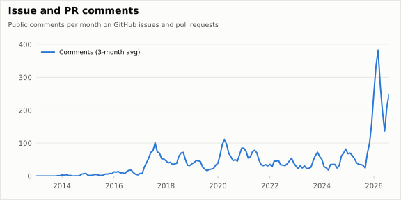
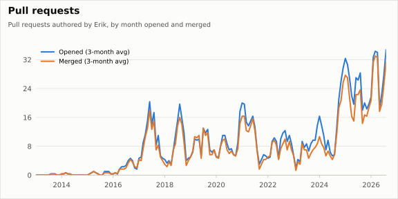
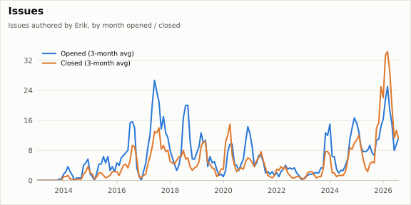
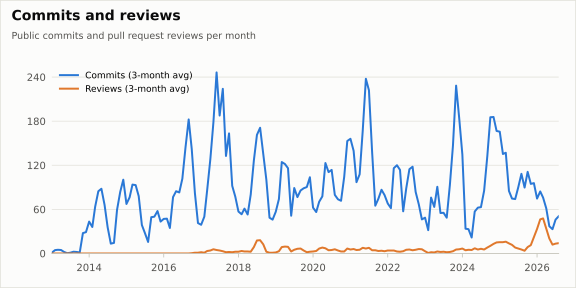

# Erik's GitHub stats

Public GitHub activity of [@ErikBjare](https://github.com/ErikBjare) over time, collected daily by a GitHub Actions cron. Inspired by [activitywatch.net/stats](https://activitywatch.net/stats/) and [gptme/stats](https://github.com/gptme/stats).

## Charts

[](data/monthly.csv)
[](data/monthly.csv)
[](data/monthly.csv)
[](data/monthly.csv)

## Latest numbers

<!-- stats:start -->
_Data through 2026-09 (UTC; the current month is partial). Machine-readable: [`data/summary.json`](data/summary.json)._

| Metric | Last 12 months | All time |
|---|---:|---:|
| Issue and PR comments | 2,877 | 8,017 |
| Pull requests opened | 326 | 1,543 |
| Pull requests merged | 306 | 1,341 |
| Pull requests closed unmerged | 66 | 153 |
| Issues opened | 219 | 1,117 |
| Issues closed | 273 | 852 |
| Pull request reviews | 282 | 845 |
| Commits | 802 | 14,157 |
<!-- stats:end -->

## Data

[`data/monthly.csv`](data/monthly.csv) has one row per calendar month (UTC) since the account was created:
`issue_comments`, `prs_opened`, `prs_merged`, `prs_closed`, `issues_opened`, `issues_closed`, `reviews`, `commits`.
[`data/summary.json`](data/summary.json) has the latest totals for websites and scripts.

The daily run recomputes the last three months and keeps older ones as they were; a manual run with `full` rebuilds everything.

### Definitions and caveats

- **Public only.** Private repositories are excluded everywhere, so the numbers match what anyone can verify.
- **Source: GitHub's GraphQL API**, not the GH Archive event stream. The archive drops events (roughly half of issue comments are missing) and stopped recording whether a PR was merged in 2024, so it can't be used for a long history.
- **Comments** are issue and pull request conversation comments, by the month they were posted. Inline review comments and discussion comments are not included. Everything posted from the `ErikBjare` account counts, whoever drafted it.
- **Pull requests** and **issues** are the ones *authored* by Erik, bucketed by the month of the event: opened by creation date, merged by merge date, closed by close date. A PR opened in June and merged in July appears in both months. Issues Erik closed on other people's repos are not counted.
- **Reviews and commits** come from GitHub's contribution graph rules: commits count on the default branch (or `gh-pages`) of a repo, and only commits attributed to Erik's account.
- **Old months can shift slightly** (a repo deleted, a PR re-opened, a commit re-attributed). The daily run only refreshes recent months; run with `--full` to resync.

## Run it

```bash
export GITHUB_TOKEN=...            # any token; public read is enough
uv run collect.py [--full]         # fetch
uv run render.py                   # charts, summary.json, README table
uv run pytest                      # tests
```
